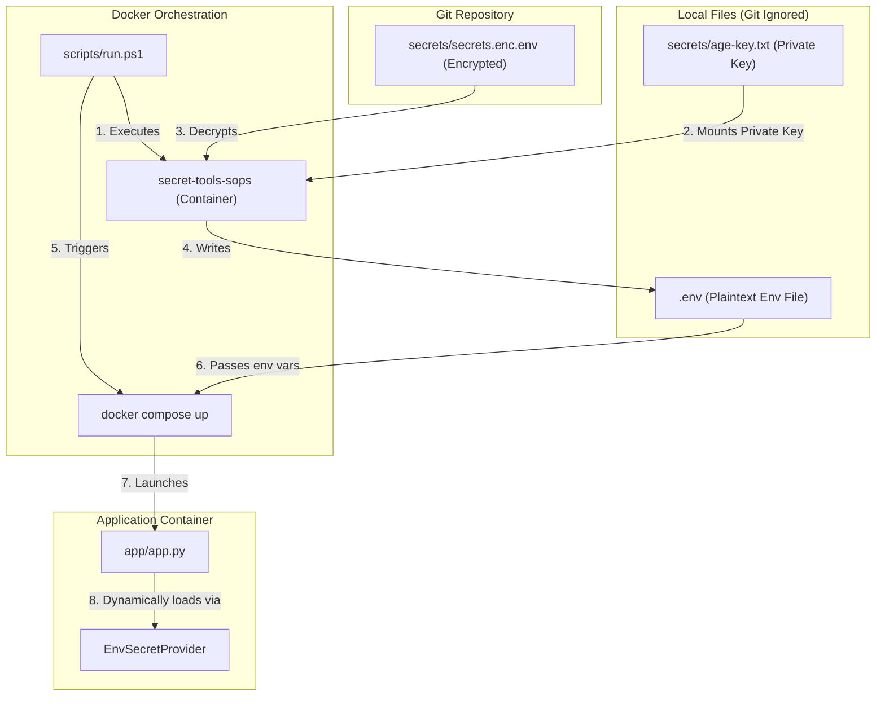

# 🔒 Secret Management POC (SOPS + Age)

This branch (`feature/sops`) implements a secure secrets-management proof of concept using **Mozilla SOPS (Secrets OPerational Support)** and **Age** encryption. 

The primary goal is to securely commit environment configuration secrets into version control (Git) while ensuring they remain encrypted. Decryption happens dynamically on the developer machine or during deployment using a gitignored private Age key.

---

## 🏗️ Architecture & Workflow

The workflow relies on dockerized versions of `sops` and `age` to avoid requiring local CLI installations on the host system.



---

## 📁 Directory Structure

```text
├── app/
│   ├── app.py                # Main application entry point (loads & masks secrets)
│   ├── config.py             # Config model mapping environment secrets
│   └── secret_provider.py    # Abstraction (SecretProvider ABC & EnvSecretProvider)
├── scripts/
│   └── run.ps1               # PowerShell orchestrator (Decrypts & launches)
├── secrets/
│   ├── age-key.txt           # Private Age key (GIT-IGNORED)
│   └── secrets.enc.env       # SOPS-encrypted configuration file
├── tools/
│   ├── age/
│   │   └── Dockerfile        # Packages FiloSottile/age encryption tool
│   └── sops/
│       └── Dockerfile        # Packages Mozilla SOPS
└── .gitignore                # Ensures private keys and plaintext envs are not leaked
```

---

## 🚀 Setup & Usage Guide

### Prerequisites
- Docker Installed and running.
- PowerShell (to execute `scripts/run.ps1`).

---

### Step 1: Build the Tool Docker Images
To run `sops` and `age` without local installations, build their helper Docker containers first:

```powershell
# Build SOPS tool container
docker build -t secret-tools-sops -f tools/sops/Dockerfile tools/sops

# Build Age tool container
docker build -t secret-tools-age -f tools/age/Dockerfile tools/age
```

---

### Step 2: Secret Encryption / Decryption Flow (SOPS)

#### **How to Generate a New Age Key**
If you need a new private key, run the `secret-tools-age` container:
```powershell
docker run --rm -v "${PWD}/secrets:/work" -w /work secret-tools-age age-keygen -o /work/age-key.txt
```
> [!IMPORTANT]
> Keep `secrets/age-key.txt` safe. It is gitignored by default and should never be committed to source control.

#### **How to Encrypt a Plaintext Env File**
If you create a temporary plaintext `secrets/secrets.env` file and want to encrypt it:
```powershell
docker run --rm `
  -v "${PWD}:/work" `
  -w /work `
  -e SOPS_AGE_KEY_FILE=/work/secrets/age-key.txt `
  secret-tools-sops `
  --encrypt `
  --age $(docker run --rm -v "${PWD}/secrets:/work" -w /work secret-tools-age age-keygen -y /work/age-key.txt) `
  --encrypted-regex '^(DB_PASSWORD|JWT_SECRET)$' `
  /work/secrets/secrets.env > secrets/secrets.enc.env
```
*(Note: `--encrypted-regex` ensures only sensitive values are encrypted, leaving keys like `DB_HOST` readable in Git for easier diffing.)*

---

### Step 3: Run the Application
The `scripts/run.ps1` script automates the decryption of environment variables to a local `.env` file and brings up the application stack.

To launch the system, simply execute:
```powershell
.\scripts\run.ps1
```

---

## 🛡️ Security Features Implemented
1. **Partial Value Encryption**: SOPS encrypts values while leaving the metadata/keys intact. This makes git diffs readable while protecting sensitive secrets.
2. **Abstract Secret Loading**: The python code uses `SecretProvider` to decouple the configuration parsing logic from how the secrets are fetched.
3. **Fail-Fast Checking**: `EnvSecretProvider` checks for missing critical environment variables and raises a `ValueError` immediately at startup rather than letting the application run in an invalid state.
4. **Git Protection**: Strict rules are set in `.gitignore` to prevent leakage of `secrets/age-key.txt`, plaintext `.env` files, or temporary decryption artifacts.
