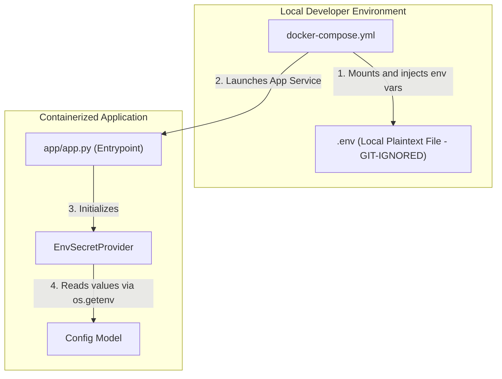

# 📄 Env-File Secret Management

This branch (`feature/env-file`) implements a standard environment-file (`.env`) based secret management flow. 

In this pattern, configuration and secrets are maintained in a local, plaintext `.env` file on the host machine. This file is excluded from version control (Git) via `.gitignore`. Docker Compose dynamically injects these variables into the containerized Python application at runtime.

---

## 🏗️ Architecture & Workflow



---

## 📁 Directory Structure

```text
├── app/
│   ├── app.py                # App entry point (verifies and prints masked configuration)
│   ├── config.py             # Config model mapping variables
│   └── secret_provider.py    # Interface & EnvSecretProvider implementation
├── Dockerfile                # Dockerfile to build and package the Python app
├── docker-compose.yml        # Orchestration layer passing the local .env to the app
└── .gitignore                # Protects secrets from being committed (.env is gitignored)
```

---

## 🚀 Setup & Usage Guide

### Prerequisites
- Docker and Docker Compose installed.

---

### Step 1: Create the Local `.env` File
Create a file named `.env` in the root of the project (this file is gitignored to prevent credential leaks):

```env
DB_HOST=db.example.com
DB_USER=admin
DB_PASSWORD=supersecretpassword
JWT_SECRET=supersecretjwtkey123
```

---

### Step 2: Build and Run the App
Launch the application container using Docker Compose:

```bash
docker compose up --build
```

#### **Expected Output**
When the application starts, it reads the environment variables, validates them, and prints the configuration with passwords masked for security:
```text
=== Configuration Loaded ===
DB_HOST: db.example.com
DB_USER: admin
DB_PASSWORD: *********************
JWT_SECRET: **********************
```

---

## 🛡️ Security Features Implemented
1. **Source Control Protection**: The `.env` file containing actual secrets is gitignored, keeping secrets strictly out of the Git history.
2. **Fail-Fast Startup**: The `EnvSecretProvider` checks for the presence of each required environment variable at initialization. If a secret is missing (e.g., `JWT_SECRET`), it raises a `ValueError` immediately rather than allowing the application to run in a degraded or broken state.
3. **Decoupled Configuration**: The app logic references a `SecretProvider` interface. If you decide to transition from `.env` files to a vault manager (e.g., HashiCorp Vault or AWS Secrets Manager) in the future, you only need to write a new implementation of `SecretProvider` without changing the application's configuration or business logic.
