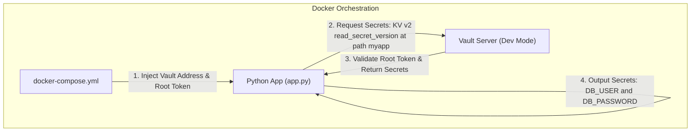

# 🔑 Secret Management POC (HashiCorp Vault KV)

This branch (`feature/hashicorp-vault-kv`) implements a basic secrets-management proof of concept demonstrating how to fetch secrets from the **HashiCorp Vault Key-Value (KV) Secrets Engine (version 2)** in a containerized Python application using token-based authentication.

In this setup, the application authenticates directly using a pre-configured Vault token (set to the developer `root` token for simplicity) to read secret keys and values.

---

## 🏗️ Architecture & Workflow

The architecture utilizes a Python client container configured with `hvac` (HashiCorp Vault API Client) and a Vault container running in Developer mode.



---

## 📁 Directory Structure

```text
├── app/
│   ├── app.py                # App entrypoint: connects to Vault using Token and prints secrets
│   ├── config.py             # Config class mapping retrieved secrets (defined for abstraction)
│   └── secret_provider.py    # Interface blueprint (SecretProvider ABC)
├── Dockerfile                # Packages the Python app and its dependencies
├── docker-compose.yml        # Orchestrates the local Vault instance and the client application
└── requirements.txt          # Python dependencies (hvac)
```

---

## 🚀 Setup & Usage Guide

### Prerequisites
- Docker and Docker Compose installed and running.

---

### Step 1: Start the Vault Service
Start the Vault container in the background to ensure it is healthy and ready to be seeded with secrets:

```bash
docker compose up -d vault
```

---

### Step 2: Configure & Seed Secrets in Vault
Vault's Developer server runs in-memory and starts fresh. Enter the Vault container to populate the KV store:

#### 1. Enter the Vault container shell
```bash
docker compose exec vault sh
```

#### 2. Configure Vault environment variables inside the container
```bash
export VAULT_ADDR=http://127.0.0.1:8200
export VAULT_TOKEN=root
```

#### 3. Seed the application secrets
Populate the Key-Value (KV v2) store at `secret/myapp` with database credentials:
```bash
vault kv put secret/myapp DB_USER="vault_user" DB_PASSWORD="vault_password123"
```

Verify that the secrets were successfully stored:
```bash
vault kv get secret/myapp
```

#### 4. Exit the container shell
```bash
exit
```

---

### Step 3: Run the Application
With Vault running and seeded, build and run the Python application container:

```bash
docker compose up --build app
```

---

### Step 4: Verify Application Output
Verify that the application successfully connected to Vault, retrieved, and printed the secret values:

```bash
docker compose logs app
```

Expected log output:
```text
vault_user
vault_password123
```

---

## 🛡️ Security & Production Considerations

> [!WARNING]
> This branch uses a static **Root Token** (`VAULT_TOKEN=root`) passed via environment variables. This is intended **only for local development and prototyping**.

For production deployments, consider the following security enhancements:
1. **AppRole Authentication**: Avoid root tokens or static long-lived tokens. Use AppRole authentication to establish machine-to-machine authentication (role/secret ID pairings), which is implemented on the [`feature/hashicorp-vault-approle`](#) branch.
2. **Least Privilege Policies**: Do not use the `root` token. Generate scoped client tokens or AppRoles attached to strict access policies.
3. **Environment Isolation**: Avoid storing sensitive credentials in plain text `docker-compose.yml` or source files.
