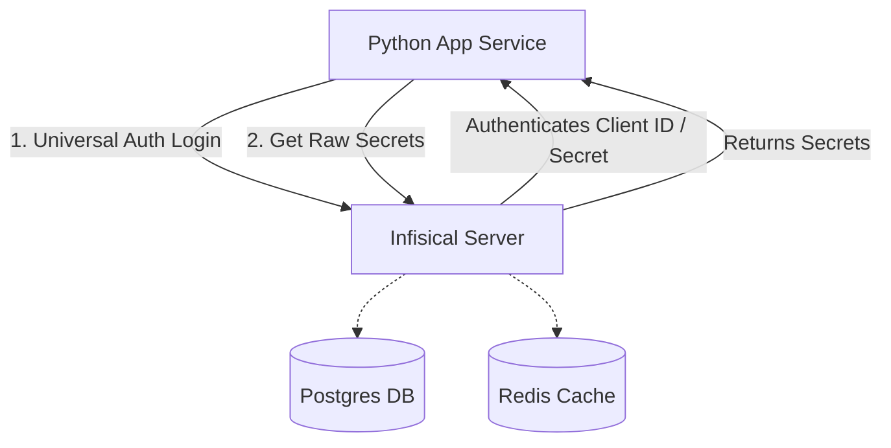

# Secret Management POC (Infisical Integration)

This repository contains a Proof of Concept (POC) demonstrating how to integrate **Infisical** as a centralized secret management provider for a Python application containerized with Docker.

The integration utilizes Infisical's **Universal Auth** client credentials flow (Client ID & Client Secret) to authenticate the application, retrieve raw secrets dynamically, and populate application configurations.

## System Architecture



The POC decouples secret storage from the application codebase using a provider pattern:
- **Abstract Blueprint**: `SecretProvider` defines the interface for fetching secrets.
- **Infisical Provider**: `InfisicalSecretProvider` implements the interface, managing token acquisition, API calls, and local key-value resolution.
- **Config Loader**: `Config` queries the provider to bind secrets directly to configuration variables at startup.

---

## File Structure

- [app/secret_provider.py](app/secret_provider.py): Abstract base class defining the `SecretProvider` interface.
- [app/infisical_provider.py](app/infisical_provider.py): Concrete class implementing the `SecretProvider` interface to talk to the Infisical REST API.
- [app/config.py](app/config.py): Configures the secret provider instance using environmental configurations and pulls the required database and JWT secrets.
- [app/app.py](app/app.py): Entrypoint to verify secrets are correctly injected and masked.
- [docker-compose.yml](docker-compose.yml): Coordinates local Postgres, Redis, Infisical service, and the client Python app.

---

## Getting Started

### 1. Prerequisites
- Docker and Docker Compose installed.

### 2. Configure Environment Variables
Create a `.env` file in the root directory and populate it with your Infisical configuration values (these are passed to the app service via Docker Compose):

```env
INFISICAL_HOST=http://infisical:8080
INFISICAL_CLIENT_ID=<your-client-id>
INFISICAL_CLIENT_SECRET=<your-client-secret>
INFISICAL_PROJECT_ID=<your-project-id>
INFISICAL_ENV=dev
```

### 3. Spin up the Services
Run docker compose to build the application and start all services (Postgres, Redis, Infisical, and the client application):

```bash
docker compose up --build -d
```

### 4. Check Application Logs
To verify that the application successfully loaded secrets from your local Infisical instance, run:

```bash
docker compose logs -f app
```

You should see logs outputting the successfully fetched config values (with passwords and secrets masked for security):

```text
=== Configuration Loaded ===
DB_HOST: localhost
DB_USER: admin
DB_PASSWORD: ****************
JWT_SECRET: ***********
```
